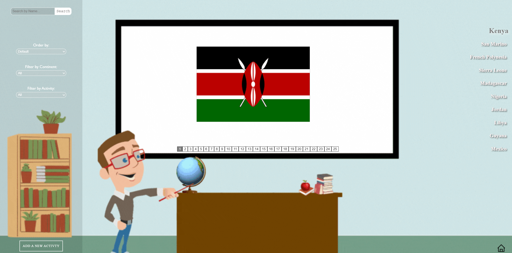

# Countries App


## Features

- Search functionality
- Filters and ordering of data
- Database
- CRUD operations
- REST API requests


## Tech Stack

**Client:** React, Redux, Next JS, CSS Modules

**Server:** JavaScript, Node JS, Express

**Database:** PostgreSQL, Sequelize


## Screenshots

**Landing**


**Home**



**Country Detail**


## Installation

1.- Clone the repo.

```bash
  git clone https://github.com/MauricioAlonso28/COUNTRIES-APP.git
```

2.- From the main folder, move to "client" directory and install dependencies.

```bash
  cd client
  npm install
```

3.- From the main folder, move to "server" directory and install dependencies.

```bash
  cd server
  npm install
```

4.- Create a local database named "countries". Create a .env file inside the "server" directory and add the following information:

```bash
    DB_USER= // Your postgres username here
    DB_PASSWORD= // Your postgres password here
    DB_HOST=localhost
```

5.- Run npm start in the terminal, located at the "server" directory.

```bash
    npm start
```

6.- Finally run npm run dev in the terminal, located at the "client" directory.

```bash
    npm run dev
```

